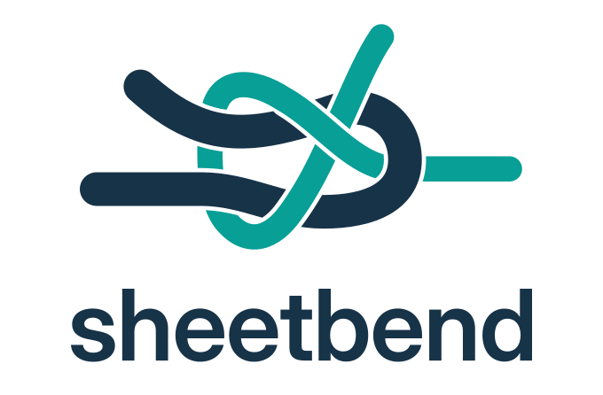

<h1 align="center">
  <picture>
    <source media="(prefers-color-scheme: dark)" srcset="docs/assets/sheetbend-logo-dark.svg">
    
  </picture>
</h1>

Discover, inspect, and verify intelligence sources from one explicit configuration.
Use the same names in a notebook, command-line application, or Python library,
without teaching every application its own endpoint and credential conventions.

**Sheetbend owns connection configuration, caller restrictions, shared request
limits, and diagnostics. [LLM](https://llm.datasette.io/) owns inference.** A
connection yields an LLM model. Prompting, conversations, attachments, tools,
schemas, and responses remain LLM's API, not another Sheetbend prompt language.

Version 0.2 adds model-specific capabilities and `sheetbend top`: a content-free
view of the applications and processes using your sources on this host.

## Install

Python 3.13 or later. Registry inspection is cross-platform; inference and shared
runtime coordination currently support Linux and macOS.

```bash
mamba create -n sheetbend_env -c conda-forge python=3.13 pip
mamba activate sheetbend_env
python -m pip install -e '.[llm]'
```

`pip install -e .` is sufficient for configuration inspection, catalog checks, and
runtime inspection. The `llm` extra adds inference and generation checks. The
adapter targets LLM 0.35 and OpenAI Python 3.x, with a deliberately bounded
compatibility range. Sheetbend's data contracts are JSON Schemas, not Pydantic
models; LLM owns any Pydantic dependency inside its inference interface.

**Updating from 0.1?** Read [the 0.2 migration notes](docs/migration-0.2.md).
Configuration schema 1 is deliberately replaced, not silently migrated.

## Configure once per environment

The default file is `${XDG_CONFIG_HOME:-$HOME/.config}/sheetbend/config.toml`, on
Linux and macOS. An explicit `config_path` takes precedence over `SHEETBEND_CONFIG`,
which takes precedence over that default. XDG paths must be absolute. Exactly one
file is selected, never a stack to merge. A relative explicit config path is
resolved from the caller's working directory.

```toml
schema_version = 2
default_source = "laptop"

[sources.laptop]
protocol = "openai-compatible"
base_url = "http://127.0.0.1:11434/v1"
default_model = "qwen3.5:4b"
scope = "local"
auth = { type = "none" }
timeout_seconds = 120

[sources.laptop.rate_limit]
requests_per_minute = 60
max_concurrent = 1

[sources.laptop.models."qwen3.5:4b"]
capabilities = { streaming = true, json_schema = true, vision = true, tools = true }
```

`laptop` is a chosen source name, not a reserved word or privacy rule. `scope` is
its declared processing boundary. Model keys are actual server model IDs, not
Sheetbend aliases. Dotted TOML headers form nested objects; the quoted model key
keeps punctuation inside one ID. Endpoint, auth, scope, and limits belong to the
source; capabilities belong to each model as served through that source.

The example above expects an already running local Ollama server and downloaded
model. Follow [the Mac deployment guide](docs/mac-local-endpoint.md) to install
one. [examples/config.toml](examples/config.toml) shows institutional and external
sources with intentionally placeholder addresses and model IDs.

An explicitly selected missing, unreadable, or malformed configuration is an
error. A missing implicit default is an empty registry. Loading, selecting, and
printing sources creates no config or runtime files, resolves no secrets, and
contacts no endpoints. There is no working-directory discovery, `.env` search,
host guessing, automatic source fallback, or automatic model enrollment.

An existing registry is an owned snapshot. Reopen it after editing the file.
Without `default_source`, callers must name a source, even when only one exists.

### Authentication and transport

The required `auth` object accepts exactly these alternatives:

```toml
auth = { type = "none" }
auth = { type = "bearer", env = "WORK_LLM_API_KEY" }
auth = { type = "header", env = "INFERENCE_API_KEY", header = "api-key" }
```

Do not paste all three into one source. The config holds references, not values.
Credentials resolve at connection entry or once per catalog request. Reconnect
after rotating them. There is no implicit OpenAI environment-key lookup, LLM key
store lookup, shell command, or process-global environment modification.

`source.resolve_auth()` is an explicit escape hatch returning **secret-bearing
HTTP headers**. Its caller owns their disclosure. Normal `to_dict()`, `repr()`,
and CLI inspection retain only configured references. Keep secrets out of source
names, descriptions, labels, model IDs, and URL paths too. Environment variables
are delivery mechanisms, not a secure vault. Third-party debug logging and Python
tracebacks can expose data outside Sheetbend's telemetry controls.

`protocol = "openai-compatible"` currently means Chat Completions at
`POST <base_url>/chat/completions` and the catalog at `GET <base_url>/models`.
No inferred `/v1`, alternate endpoint, Responses routing, or provider plugin.
A missing catalog route does not imply inference is unavailable; try a text check.

HTTPS verifies certificates. Optional `ca_bundle` paths resolve relative to the
selected configuration's directory, or the construction-time working directory
for `Registry.from_dict()`. There is no `verify = false`. Non-loopback HTTP
requires explicit `allow_insecure_http = true`. Redirects and environment HTTP
proxies are disabled. Ambient `OPENAI_CUSTOM_HEADERS` is rejected rather than
silently changing source-bound credentials. SDK retries are disabled.

### Caller boundaries

```python
from sheetbend import Registry

registry = Registry.from_file()
source = registry.source(
    "work",
    allowed_scopes={"institutional"},
    organization="company",
)
```

`Registry.source()` defaults to `{"local", "institutional"}`. External access must
be explicitly allowed, for example `allowed_scopes={"external"}` for an external
source, or all three scopes for an unrestricted application. An empty collection
permits none; `None` is not an unrestricted shorthand.

`local` means processing on the executing Python process's host, not the laptop
showing a remote notebook. A tunnel is not local processing. `institutional`
requires an organization identifier; other scopes must not include one.
`organization="company"` is an exact configured boundary check, not an SDK header.
These declarations do not certify privacy, institutional approval, model safety,
or absence of onward forwarding. There is no automatic trust ranking or rerouting.

## Use the native LLM API

```python
from sheetbend import Registry

source = Registry.from_file().source("laptop", allowed_scopes={"local"})
print(source)
print(source.model_names)

with source.connect(
    requires={"json_schema"},
    application="notebook",
    tool="exploration",
) as model:
    response = model.prompt("Say hello in one sentence.", stream=False)
    text = response.text()

print(text)
```

`connect(model="another-configured-id")` selects another declared model at the
same source. Normal connections reject unconfigured IDs. `requires` checks the
selected model's declarations before credentials, network work, or runtime file
creation. It does not run paid probes, infer support, or choose an alternative.

Capability defaults come from the packaged config schema: `streaming=true`,
`system_prompt=true`, and `json_schema=vision=tools=false`. A probe may explicitly
try an undeclared capability or unconfigured model without changing these values.

Application and tool labels are optional, connection-scoped display metadata.
`tool` means your application operation/subcommand, not a model-requested function.
Unlabeled callers use the Python executable basename. PID and process-instance
identity are collected automatically. Labels are not authenticated identities;
command lines, notebook names, and input paths are not inferred.

**Consume lazy responses inside the context.** Preparing a response need not
send a request. Consuming it does. Completed text may outlive the context, but new
requests and resuming unfinished responses after closure fail. Do not carry an
open connection across a fork. Finish worker threads before closing their shared
connection. Context exit cancels abandoned streams and waiting admissions; it
cannot promise that a remote provider stops already accepted computation.

```python
import json
from jsonschema import Draft202012Validator

schema = {
    "type": "object",
    "properties": {"greeting": {"type": "string"}},
    "required": ["greeting"],
    "additionalProperties": False,
}

with source.connect(requires={"json_schema"}, application="my-app") as model:
    response = model.prompt("Return a greeting.", schema=schema, stream=False)
    result = json.loads(response.text())

Draft202012Validator(schema).validate(result)
```

Conversations remain `model.conversation()`, tools and attachments remain LLM
objects, and no Sheetbend `prompt()` or `generate()` is introduced. Application
validation remains appropriate: an endpoint accepting a schema is not proof of
arbitrary schema enforcement.

## Inspect and verify

```bash
sheetbend sources
sheetbend inspect laptop --json
sheetbend check laptop                         # Catalog only
sheetbend check laptop --test text
sheetbend check laptop --test schema
sheetbend check laptop --test stream
sheetbend check laptop --test tools
sheetbend check laptop --test vision
sheetbend check laptop --all --json            # All six, including undeclared capabilities
sheetbend check external --test text --allow-external
sheetbend schema --name config
sheetbend schema --name check-report
sheetbend version
```

Global `--config-path` precedes the subcommand. Offline `sources` and `inspect`
show all configured scopes. Endpoint checks exclude external sources unless
`--allow-external` is supplied. `version`, `schema`, and `top` do not need valid
configuration. A failing check/report exits 1. `--all` and `--test` are exclusive.

Checks send fixed synthetic data, never user files or notebook variables. Text,
schema, streaming, tools, and vision checks generate responses and may incur
charges. The tools probe verifies one proposed call and its arguments without
executing code. The vision probe sends a generated green PNG and requires the
color to be identified. These are narrow mechanical observations, not benchmarks
or certifications. Output includes a timestamp and the prior capability declaration
(`null` when not applicable or the model was unconfigured).

`source.list_models()`, `source.check(test="schema")`, and `source.check_all()` are
public library stages. Ordinary operations raise at the first failure; the
explicit diagnostic report intentionally collects all six results. No automatic
startup probing, config rewriting, or client retries. Probes request short answers
but do not impose a provider-independent token ceiling or cost guarantee.

## Shared limits and `sheetbend top`

```bash
sheetbend top
sheetbend top --once
sheetbend top --json
```

The live view identifies PID, application, tool, source, model, state, age, and
provider-reported token counts. One row represents one request, not one process.
It can see requests that began before the viewer opened. Closing the viewer has
no effect on callers. For notebook inspection, use `Runtime().snapshot()`:

```python
from sheetbend import Runtime

activity = Runtime().snapshot()
```

`requests_per_minute` is a rolling 60-second limit on admitted request starts.
`max_concurrent` covers active client requests through response consumption.
Catalog calls and all models of a source share both limits. Failed attempts count.

The bucket is **the canonical config-file path plus source name**, shared across
this user's participating processes on this host. Separate file-backed registries
share it. Symlink paths to the same file share it. Different source entries/config
files are deliberately not deduplicated. `Registry.from_dict()` has no shared file
identity and receives a private registry namespace; its activity is still visible
in `top`. Use a common config file for cross-application quotas.

Conflicting endpoint/auth-reference/boundary/limit definitions cannot reset a busy
bucket. Reload callers consistently and let recent starts age out of the 60-second
window. Different model capability declarations do not create extra request budgets.

The host-local SQLite ledger is also the activity source. Short transactions reserve
slots; no transaction remains open during inference or waiting. No daemon or
background heartbeat thread. Dead-process cleanup checks PID **and process creation
time**, not an inactivity timeout that could evict a live, paused request. The next
request or snapshot performs cleanup. A runtime failure raises an error rather than
silently allowing unlimited traffic. Coordination is cooperative, not a security
boundary against applications deliberately bypassing Sheetbend.

Runtime directory precedence is `SHEETBEND_RUNTIME_DIR`, then
`$XDG_RUNTIME_DIR/sheetbend`, then the macOS local user temp directory or Linux
`/tmp/sheetbend-<uid>`. It must be a private 0700 directory on a **local** filesystem;
parents must already exist. Known network filesystem types are rejected, but this
check cannot identify every exotic mount. The database is private and boot-scoped; new requests remove prior-boot ledger files.
Do not delete or relocate runtime state while clients are active. All cooperating
applications and viewers must use the same runtime directory.

The ledger stores no prompts, response bodies, resolved credentials, URLs, input
paths, raw command lines, or exception messages. It retains active requests and up
to 1,000 recent completions for ten minutes, pruning during activity. Recent-start
accounting is separate, so pruning the display does not erase a rate budget. SQLite
can retain previously used disk pages; this is bounded operational state, not a
forensic erasure guarantee or an audit log.

`waiting` means waiting for a Sheetbend permit. `running` means admitted;
`streaming` begins after the first yielded upstream event. `done` means the client
consumed the response, not that its content passed application validation. Failed,
cancelled, and abandoned requests remain distinguishable. Token values stay `?`
until reported, usually at completion. No guessed live token counter.

Separate users and cluster nodes have separate coordination domains. A shared NFS
home does not turn this into a cluster-wide quota service. Provider quotas remain
authoritative. No token-per-minute limits, fairness guarantee, or cross-host routing.
`timeout_seconds` is the network operation/inactivity timeout, not a total request
or queue deadline. Consume or close streams before starting work that would exceed
their shared concurrency limit.

## Development

```bash
python -m pip install -e '.[llm,dev]'
SHEETBEND_REQUIRE_LLM_TESTS=1 pytest
ruff check .
python -m pip wheel --no-deps --wheel-dir dist .
```

CI runs Linux and macOS on Python 3.13 and 3.14 and requires the actual LLM/SDK
integration module. Core tests use real SQLite, spawned processes, and loopback
HTTP; adapter unit tests are explicitly labeled test doubles. The actual integration
module separately covers LLM prompting, schemas, conversations, streaming, tools,
vision, auth, and telemetry. Without the optional extra it is skipped locally,
which is not an integration pass.

`pyproject.toml` is the sole authored package version. The config, check,
check-report, and activity schemas are packaged with `py.typed`. The experimental
API and Apache-2.0 license remain. See [the branding notes](docs/branding.md) for
the SVG logo assets and their knot construction.

### Implementation references

- [XDG Base Directory Specification](https://specifications.freedesktop.org/basedir/latest/)
- [LLM Python API](https://llm.datasette.io/en/stable/python-api.html)
- [LLM 0.35 OpenAI-compatible implementation](https://github.com/simonw/llm/blob/0.35/llm/default_plugins/openai_models.py)
- [SQLite WAL and its same-host limitation](https://www.sqlite.org/wal.html)
- [psutil process identity](https://psutil.readthedocs.io/en/latest/)
