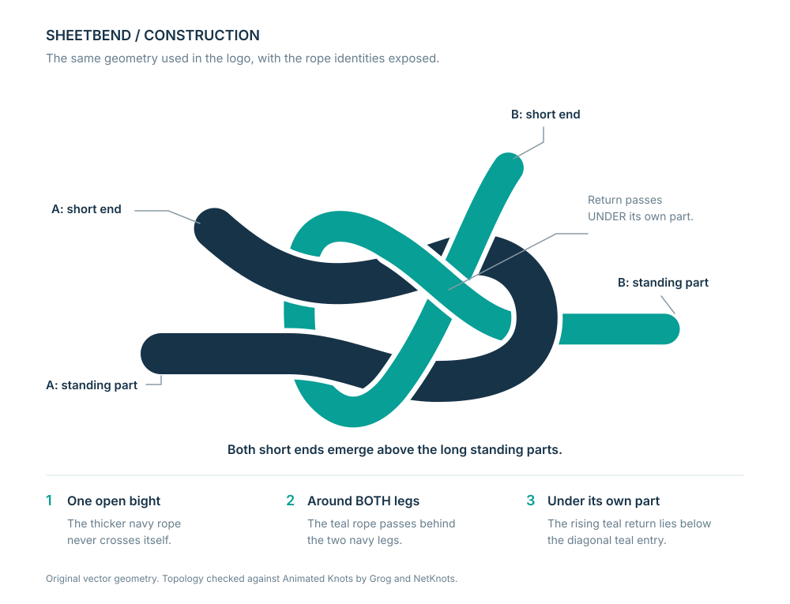

# Sheetbend visual identity

The mark is an original vector drawing of a single sheet bend joining two separate
ropes. A thicker ink-navy rope forms a bight; a thinner teal rope makes the wrap and
self-tuck. Flat colors, different rope weights, and transparent crossing gaps keep
the construction legible without simulated rope texture, shadows, or gradients.

## Assets

| File | Use |
| --- | --- |
| `assets/sheetbend-logo.svg` | Mark and outlined wordmark on a light background. |
| `assets/sheetbend-logo-dark.svg` | Pale-ink and teal version for a dark background. |
| `assets/sheetbend-mark.svg` | The standalone light-background knot. |
| `assets/sheetbend-mark-dark.svg` | The standalone dark-background knot. |
| `assets/sheetbend-mark-mono.svg` | One-color mark with the same transparent crossing gaps. |
| `assets/sheetbend-construction.svg` | Labeled diagram of the same knot geometry. |

The logo files are about 7.7 KiB each; the standalone marks are about 4 KiB each.
Commit the SVGs directly to ordinary Git. Do not add an LFS rule for these assets.
[Git LFS](https://docs.github.com/en/repositories/working-with-files/managing-large-files/about-git-large-file-storage)
is for large-file storage; these are small, editable text files.

The five logo/mark assets have transparent backgrounds. Their crossing gaps also
remain transparent: they are masks, not white strokes painted over another rope.
The construction sheet alone has a white background for its labels.

The wordmark is Inter Display Semibold rendered as vector outlines. No font file
is embedded or distributed, and the finished wordmark does not require a local
font installation. The explanatory construction sheet uses ordinary live text
with Inter/Arial/sans-serif fallbacks. The drawings contain no raster images,
scripts, network dependencies, or external SVG references.

## The knot, not merely its silhouette

The rope routing was checked against the tying sequence and same-side-tail rule in
[Animated Knots by Grog](https://www.animatedknots.com/sheet-bend-knot) and
[NetKnots](https://www.netknots.com/rope_knots/sheet-bend).
Those are structural references; their artwork is not included or traced.



The navy centerline is one continuous open bight with two ends and no
self-crossing. The teal centerline is another continuous open path with two ends.
It enters the bight, passes behind both navy legs, comes back across the front,
and tucks under its own incoming part. The two short working ends are above the
standing parts, matching the same-side arrangement of the reference knot.

In this particular projection there are six crossings between the ropes and one
self-crossing of the teal rope. Following teal from its long right-hand standing
part toward its short upper end gives:

| Order | Crossing | Above | Below |
| --- | --- | --- | --- |
| 1 | Bight nose | Navy | Teal |
| 2 | Upper leg on entry | Teal | Navy |
| 3 | Back of upper leg | Navy | Teal |
| 4 | Back of lower leg | Navy | Teal |
| 5 | Lower leg on return | Teal | Navy |
| 6 | Self-tuck | Teal entry | Teal return |
| 7 | Upper leg on exit | Teal | Navy |

The SVG element names preserve this organization: `rope-a`, `rope-b-entry`, and
`rope-b-wrap-and-tuck`. The two teal drawing pieces meet at exactly `(278, 160)`;
they are one rope, split only to allow the self-crossing to be masked correctly.
Do not change crossing order while editing the geometry.

The construction checks established continuous adjoining curve endpoints, four
terminal ends, no navy self-intersection, six navy/teal intersections, and one
teal self-intersection. The rendered overpass colors were checked at all six
navy/teal intersections. The self-tuck and full drawing were inspected visually.
This is a geometric and reference-based check, not a formal knot-equivalence
proof or a physical strength test.

## README embedding

The repository README uses the light artwork as its fallback and the dark artwork
when a dark color scheme is selected:

```html
<h1 align="center">
  <picture>
    <source media="(prefers-color-scheme: dark)"
            srcset="docs/assets/sheetbend-logo-dark.svg">
    
  </picture>
</h1>
```

GitHub documents support for the [`picture` element and relative image paths](https://docs.github.com/en/get-started/writing-on-github/getting-started-with-writing-and-formatting-on-github/basic-writing-and-formatting-syntax#images).
The paths above are relative to the repository-root README. Use `assets/...`
inside documents in this `docs` directory. Use the standalone mark without the
wordmark when space is tight; inspect the actual raster size before choosing a
very small favicon, where the crossing details can become hard to distinguish.
